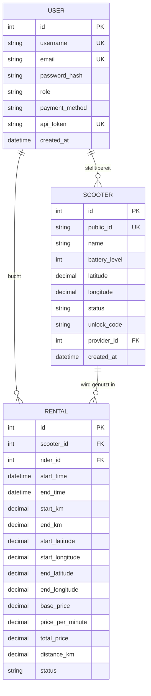
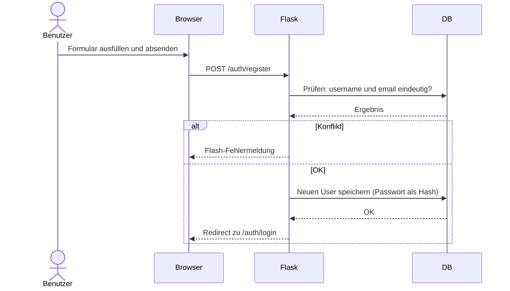
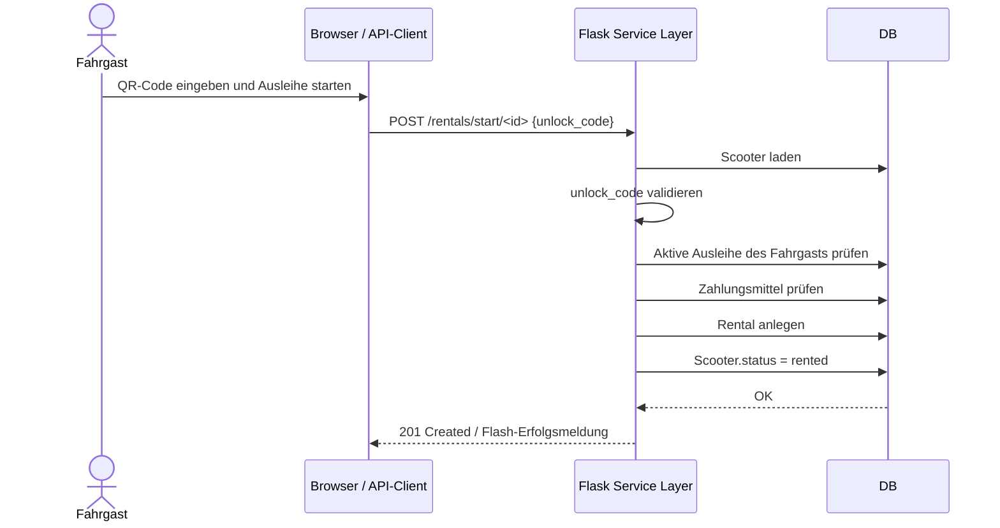
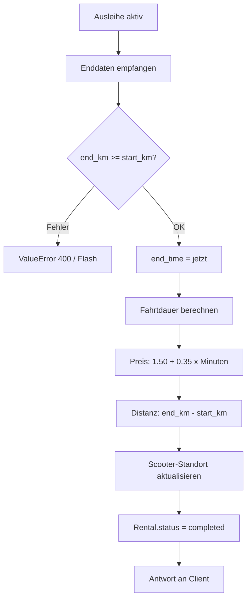
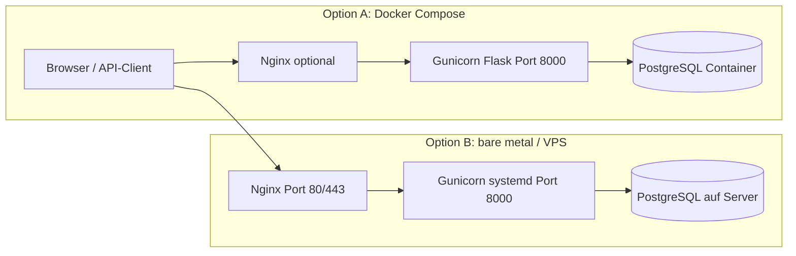

# Systemarchitektur

## Architekturprinzip

Die Anwendung folgt einer klassischen **3-Schichten-Architektur**:

1. **Präsentationsschicht** – HTML-Templates (Jinja2), CSS, JavaScript (Leaflet.js für die Karte)
2. **Applikationsschicht** – Flask-Blueprints und Service-Layer (`services.py`)
3. **Datenhaltungsschicht** – PostgreSQL 16 mit SQLAlchemy ORM

Die Geschäftslogik (Ausleihe starten/beenden, Preisberechnung, Validierungen) ist bewusst vom HTTP-Layer getrennt und im Service-Layer konzentriert. Dadurch können dieselben Funktionen sowohl von den Web-Routen als auch von der API verwendet werden.

---

## Flask-Module (Blueprints)

| Modul | URL-Präfix | Aufgabe |
|---|---|---|
| `main` | `/` | Startseite, Dashboard |
| `auth` | `/auth` | Registrierung, Login, Logout |
| `providers` | `/providers` | Scooter-Verwaltung für Anbieter |
| `rentals` | `/rentals` | Start und Ende von Ausleihen (Web) |
| `api` | `/api` | RESTful API-Endpunkte |

---

## Datenmodell (ERD)



**Datenbank-Constraints (PostgreSQL):**
- `users.role` ∈ `{rider, provider}`
- `scooters.status` ∈ `{available, rented, maintenance}`
- `scooters.battery_level` ∈ 0–100
- `rentals.status` ∈ `{active, completed}`
- `rentals.end_km >= rentals.start_km` (wenn gesetzt)
- Fremdschlüssel mit `ON DELETE RESTRICT` (kein Löschen von Usern/Scootern bei offenen Ausleihen)

**Indizes für Performance:**
```sql
idx_scooters_provider_id, idx_scooters_status
idx_rentals_scooter_id, idx_rentals_rider_id, idx_rentals_status
```

---

## Wichtige Abläufe

### Registrierung



### Scooter ausleihen



### Ausleihe beenden und verrechnen



---

## Deployment-Varianten



### Option A – Docker Compose (empfohlen für schnellen Start)

```bash
cp .env.example .env   # Secrets anpassen
docker compose up -d
```

Die Anwendung ist anschliessend unter `http://SERVER_IP:8000` erreichbar. Nginx kann optional vorgeschaltet werden.

### Option B – bare metal mit systemd

```bash
# 1. Virtualenv und Abhängigkeiten
python -m venv .venv && source .venv/bin/activate
pip install -r requirements.txt

# 2. Umgebungsvariablen setzen (.env-Datei)
# DATABASE_URL, SECRET_KEY, APP_BASE_URL

# 3. Systemd-Dienst installieren
sudo cp deploy/escooter.service /etc/systemd/system/
sudo systemctl daemon-reload
sudo systemctl enable --now escooter

# 4. Nginx als Reverse Proxy konfigurieren
sudo cp deploy/nginx.conf /etc/nginx/sites-available/escooter
sudo ln -s /etc/nginx/sites-available/escooter /etc/nginx/sites-enabled/
sudo systemctl reload nginx
```

---

## Architekturentscheidungen: Vor- und Nachteile

| Entscheidung | Vorteile | Nachteile |
|---|---|---|
| Flask mit Blueprints | Klare Modularität, gute Testbarkeit | Weniger Konventionen als Django; mehr Konfigurationsaufwand |
| PostgreSQL | Produktionsreif, mächtige Constraints und Indizes | Schwergewichtiger als SQLite; erfordert separaten Dienst |
| Gunicorn | Einfaches Deployment, Multi-Worker-fähig | Kein HTTP/2; für sehr hohe Last wären Load-Balancer nötig |
| Session-Login + API-Token | Zwei getrennte Zugangswege für Browser und API-Clients | Erhöhte Komplexität; Token wird nicht bei Logout invalidiert |
| `db.create_all()` beim Start | Einfach für Lernprojekte | Für Produktionsbetrieb besser: explizite Migrations via Flask-Migrate |
| Unlock-Code als Freitext | Einfache Demo-Implementierung | Produktiv: echter QR-Code-Scanner in mobiler App notwendig |
