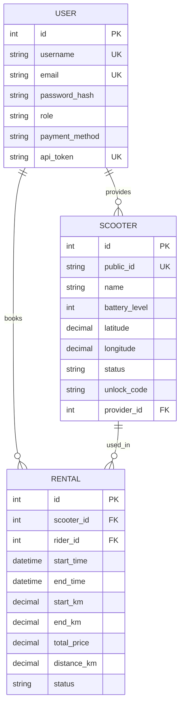
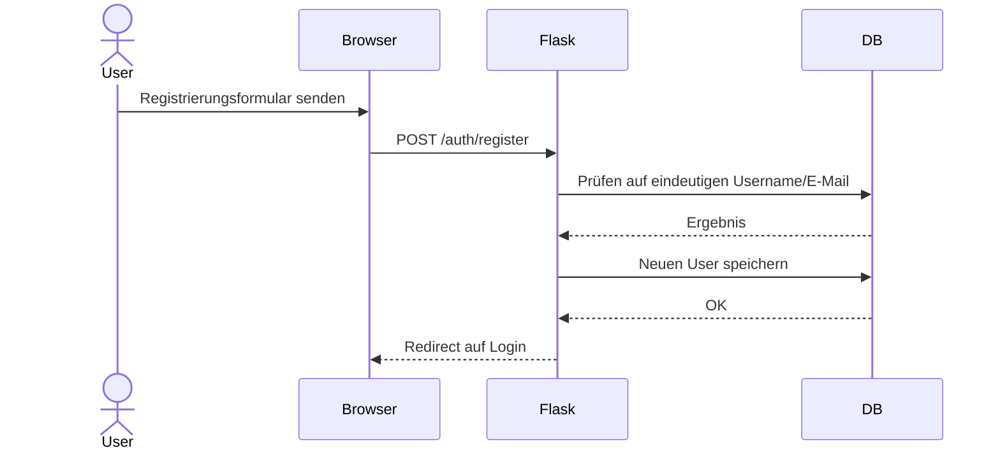
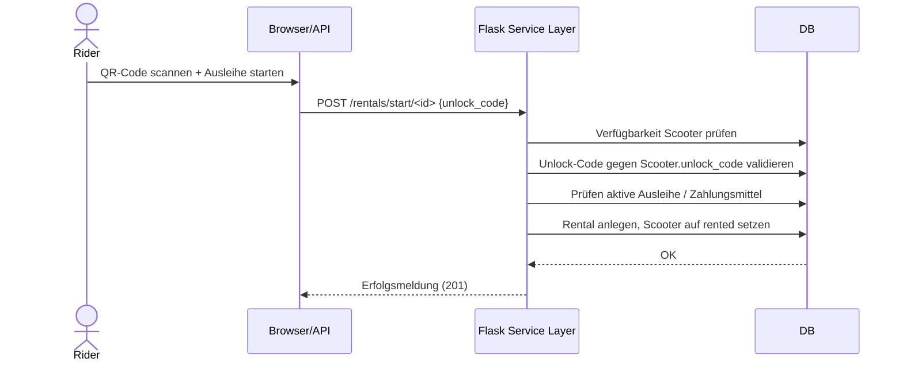
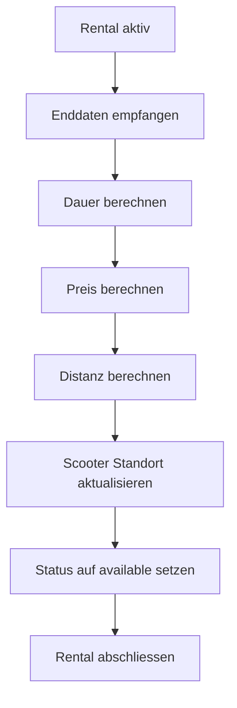
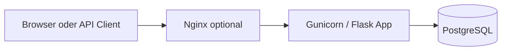

# Architektur und Lösungsansatz

## Anforderungen

- Interaktive Weboberfläche
- Registrierung mit eindeutigem Benutzername und E-Mail
- Passwortgeschützte Benutzerkonten
- Relationale Datenbank mit PostgreSQL
- Eigene Geschäftslogik für Ausleihe, Rückgabe und Preisberechnung
- RESTful API für ausgewählte Daten ohne Browser
- Deployment über Linux/Gunicorn, optional Nginx

## Gewählte Domäne

Es wurde die Normaufgabe umgesetzt: eine Plattform zum Verleih von E-Scootern.

## Architekturprinzip

Die Anwendung verwendet eine klassische 3-Schichten-Struktur:

1. Präsentation: HTML-Templates und Browser-Interaktion
2. Applikation: Flask-Blueprints und Service-Layer für Geschäftslogik
3. Datenhaltung: PostgreSQL mit relationalem Schema

## Flask-Module

- `main`: Startseite und Dashboard
- `auth`: Registrierung, Login, Logout
- `providers`: Verwaltung der Scooter-Flotte
- `rentals`: Start und Ende von Ausleihen
- `api`: REST-Endpunkte und Token-Authentifizierung

## Datenmodell (ERD in Textform)

## Wichtige Abläufe

### Registrierung

### Scooter ausleihen

### Rückgabe und Verrechnung

## Deployment / Bereitstellung

## Begründung der Architektur

### Vorteile

- Gute Wartbarkeit durch Blueprints und klar getrennte Verantwortlichkeiten
- Relationales Modell passt gut zu User, Scooter und Rentals
- PostgreSQL ist robust, verbreitet und produktionsgeeignet
- Gunicorn + optional Nginx ist ein üblicher Linux-Stack
- API-Token erlaubt Zugriff ohne Browser und erfüllt die Vorgabe

### Nachteile

- Session-Login und API-Token sind zwei Authentifizierungswege und erhöhen die Komplexität leicht
- Kein asynchrones Processing; für sehr hohe Last wären zusätzliche Optimierungen nötig
- `db.create_all()` ist für Lernprojekte akzeptabel, für harte Produktion wären Migrationen strikter zu verwenden

## Skalierbarkeit, Wartbarkeit, Verfügbarkeit

- **Wartbarkeit:** Modularisierung, Service-Layer, Tests
- **Skalierbarkeit:** Mehrere Gunicorn-Worker, Trennung von Web und DB, Containerisierung
- **Verfügbarkeit:** systemd Restart, Docker Restart Policy, Reverse Proxy, Backups, Monitoring
